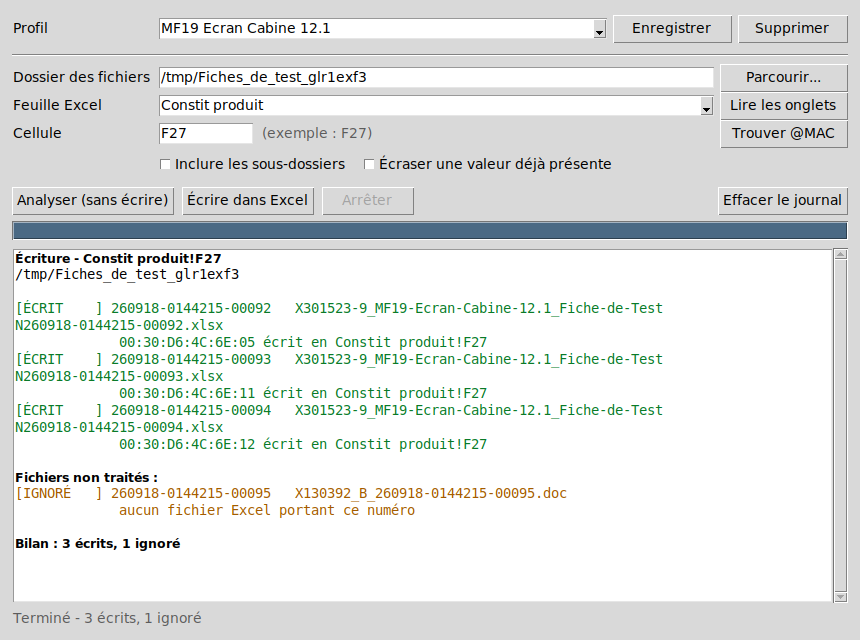

# Extraction MAC — du Word vers la fiche de test Excel

Reporte automatiquement l'adresse MAC lue dans chaque fichier Word vers la
cellule voulue de la fiche de test Excel correspondante, au format
`xx:xx:xx:xx:xx:xx`.

Les deux fichiers d'une même série sont appariés par le numéro présent dans
leur nom, de la forme `xxxxxx-yyyyyyy-zzzzz` :

```
X130392_B_260918-0144215-00092.doc                              ─┐
X301523-9_MF19-Ecran-Cabine-12.1_Fiche-de-Test N°260918-0144215-00092.xlsx  ─┘  même série
```

Le reste du nom peut être quelconque, et les tirets du numéro sont facultatifs
(`260918014421500092` est reconnu de la même façon).

## Installation

### Option 1 — l'exécutable (rien à installer)

`ExtractionMAC.exe` est autonome : ni Python, ni bibliothèque, ni droits
administrateur. Le copier où l'on veut et double-cliquer.

Il est reconstruit à chaque modification du code par
[l'action GitHub « Construire l'exécutable Windows »](../../actions/workflows/build-exe.yml) :
ouvrir la dernière exécution réussie et télécharger l'artefact
**ExtractionMAC-windows**. Il contient l'exécutable et son empreinte SHA-256.

> Le premier lancement peut déclencher un avertissement SmartScreen
> (« Windows a protégé votre ordinateur ») : c'est le comportement normal pour
> un exécutable non signé. *Informations complémentaires* → *Exécuter quand même*.
> Certains antivirus signalent aussi à tort les exécutables PyInstaller ; comparer
> l'empreinte SHA-256 fournie permet de vérifier que le fichier est bien celui produit.

### Option 2 — depuis les sources

Le programme n'utilise que la bibliothèque standard de Python : **aucun
`pip install` n'est nécessaire**.

1. Installer Python 3.8 ou plus récent depuis <https://www.python.org/downloads/windows/>
   en cochant **« Add python.exe to PATH »** et **« tcl/tk and IDLE »**.
2. Double-cliquer sur `Lancer_ExtractionMac.bat`.

`Creer_executable.bat` refabrique l'exécutable localement, sur un poste Windows
disposant de Python.

## Utilisation



1. **Dossier des fichiers** — le dossier contenant les `.doc` et les `.xlsx`.
   Ils peuvent être nombreux : tous les couples sont traités en une fois.
2. **Feuille Excel** — le bouton *Lire les onglets* remplit la liste à partir du
   premier classeur trouvé dans le dossier.
3. **Cellule** — par exemple `F27`. Le bouton *Trouver @MAC* liste les cellules
   contenant « MAC » dans le classeur, pour repérer où se trouve le libellé.
4. **Analyser (sans écrire)** — vérifie tout sans modifier le moindre fichier.
   À faire systématiquement avant la première écriture sur un nouveau modèle de fiche.
5. **Écrire dans Excel** — demande confirmation, puis écrit.

### Enregistrer la configuration

Saisir un nom dans le champ **Profil** puis cliquer sur **Enregistrer** : le
dossier, l'onglet, la cellule et les options sont mémorisés. Au lancement
suivant, le dernier profil utilisé est rechargé automatiquement ; on peut aussi
en choisir un autre dans la liste.

Les profils sont enregistrés dans **`ExtractionMAC-config.json`, à côté de
l'exécutable** (ou à la racine du projet si l'on lance les sources). L'outil est
donc portable : copier le dossier — ou le mettre sur une clé USB — et les profils
suivent. La barre d'état affiche l'emplacement exact au démarrage.

> **Repli automatique.** Si ce dossier n'est pas accessible en écriture —
> exécutable posé dans `C:\Program Files`, sur un partage réseau en lecture
> seule, sur une clé protégée — la configuration bascule vers
> `%APPDATA%\ExtractionMac\`. Sans ce repli, l'enregistrement échouerait sans
> raison apparente. À la lecture, le fichier situé à côté de l'exécutable est
> prioritaire.
>
> En cas de doute, `ExtractionMAC.exe --diagnostic` écrit un fichier
> `ExtractionMAC-diagnostic.txt` indiquant les emplacements retenus.

### Options

| Option | Effet |
| --- | --- |
| Inclure les sous-dossiers | parcourt aussi les dossiers contenus dans le dossier choisi |
| Écraser une valeur déjà présente | sans cette case, une cellule déjà remplie avec une **autre** valeur n'est jamais modifiée ; l'écart est signalé dans le journal |

Relancer le traitement sur un dossier déjà traité est sans risque : les
cellules déjà correctes sont signalées « DÉJÀ OK » et laissées telles quelles.

## Ce que fait le programme, précisément

**Lecture du Word.** Trois formats sont acceptés sans configuration :
`.docx`, `.doc` binaire Word 97-2003, et `.rtf` renommé en `.doc`. La recherche
privilégie toujours une ligne portant le libellé « MAC », et accepte les
notations `00-30-D6-4C-6E-05`, `00:30:D6:4C:6E:05`, `0030.D64C.6E05` et
`0030D64C6E05`. Un numéro de série ne peut pas être confondu avec une adresse
MAC. Si le document contient deux adresses MAC différentes, le fichier est
signalé en erreur plutôt que traité au hasard.

**Écriture de l'Excel.** Seule la feuille visée est réécrite ; toutes les autres
pièces du classeur sont recopiées **octet pour octet**. C'est un choix
délibéré : ces fiches contiennent des images, des contrôles de formulaire, des
réglages d'impression et des mises en forme conditionnelles qu'une réécriture
par une bibliothèque tierce ferait disparaître. Le style de la cellule
(bordures, police, fond) est conservé. La valeur est écrite en texte, donc
jamais réinterprétée par Excel.

Si la cellule visée appartient à une plage fusionnée, la valeur est écrite dans
la cellule d'ancrage de la fusion.

## Cas signalés dans le journal

| Statut | Signification |
| --- | --- |
| `ÉCRIT` | adresse MAC écrite dans la cellule |
| `À ÉCRIRE` | résultat d'une analyse : ce qui serait écrit |
| `DÉJÀ OK` | la cellule contient déjà cette adresse MAC |
| `IGNORÉ` | fichier Word sans Excel (ou l'inverse), ou cellule déjà remplie avec une autre valeur |
| `ERREUR` | MAC introuvable ou ambiguë, onglet absent, fichier verrouillé, doublon de numéro… |

Un fichier `.xls` (Excel 97-2003) ne peut pas être traité : le signaler et
l'enregistrer au format `.xlsx`. Un classeur ouvert dans Excel est verrouillé :
le fermer avant de relancer.

## Développement

```
extraction_mac/
├── serial.py    appariement .doc / .xlsx par le numéro xxxxxx-yyyyyyy-zzzzz
├── docmac.py    lecture de l'adresse MAC dans le Word (docx, doc binaire, rtf)
├── xlsxcell.py  lecture et écriture chirurgicale d'une cellule .xlsx / .xlsm
├── runner.py    appariement du dossier et exécution
├── config.py    profils enregistrés (à côté du programme, repli %APPDATA%)
└── gui.py       fenêtre Tkinter
```

Tests (40 cas, sans aucune donnée client — les fichiers d'essai sont fabriqués
à la volée) :

```
python -m unittest discover -s tests -t .
```

## Réglages avancés

Certains réglages ne sont pas exposés dans la fenêtre mais modifiables dans
`ExtractionMAC-config.json`, par profil :

| Clé | Défaut | Rôle |
| --- | --- | --- |
| `separateur_mac` | `":"` | séparateur entre octets de l'adresse MAC |
| `mac_majuscules` | `true` | `false` pour écrire `00:30:d6:4c:6e:05` |
| `groupes_numero` | `[6, 7, 5]` | longueurs des trois groupes du numéro de série |
